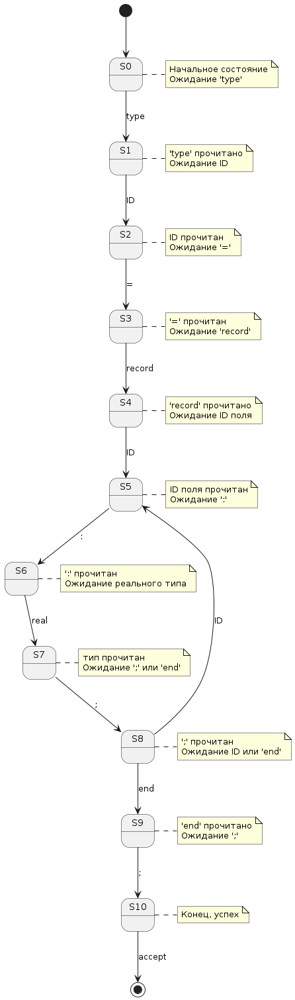
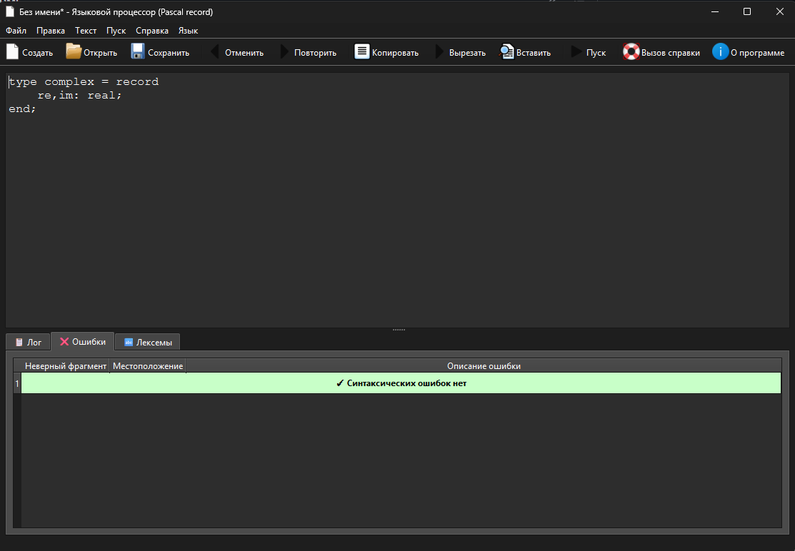
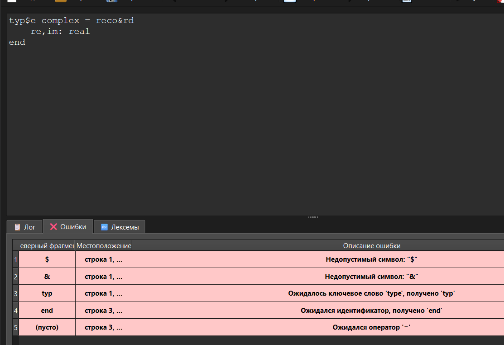
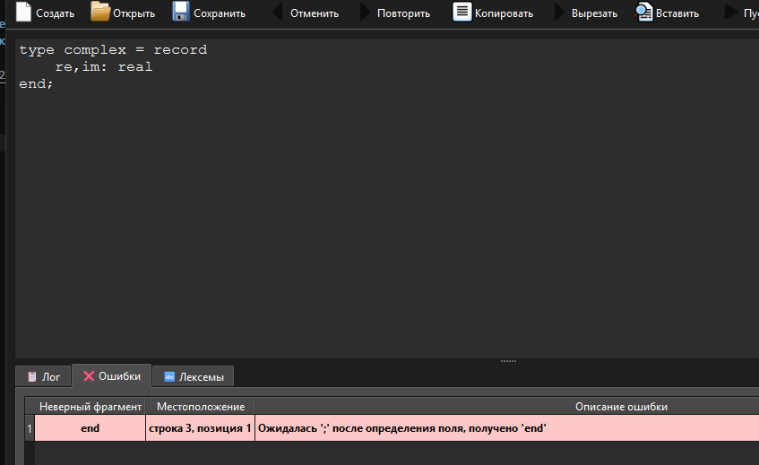
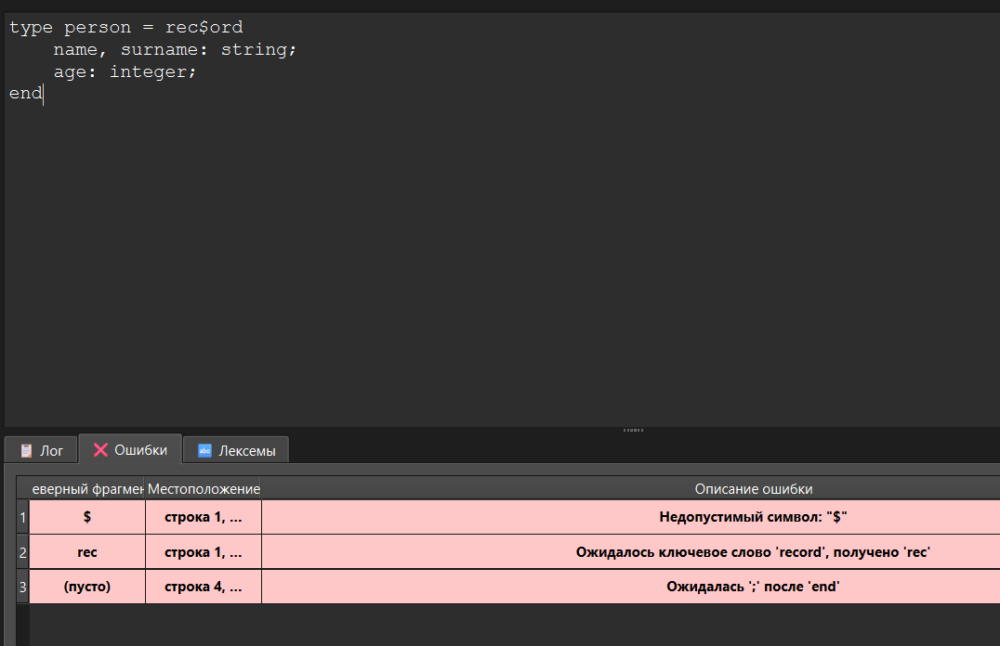
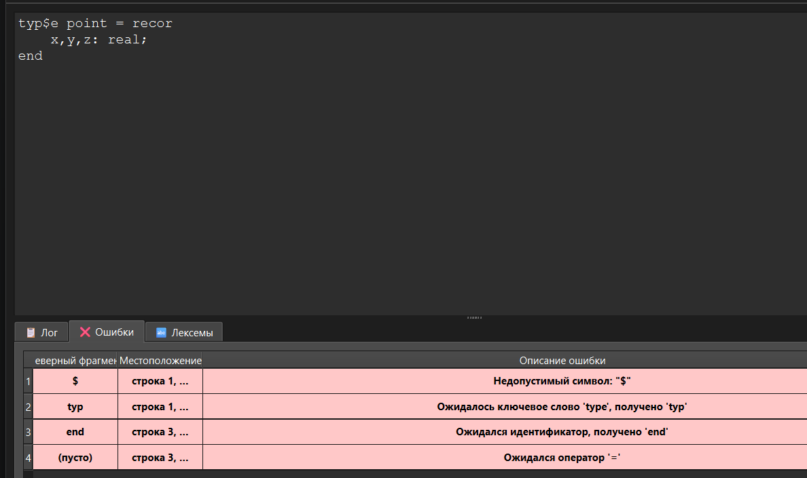

# Лабораторная работа 3: Разработка синтаксического анализатора (парсера)

## Цель работы
Изучить назначение и принципы работы синтаксического анализатора в структуре компилятора. Спроектировать грамматику, построить соответствующую схему метода анализа грамматики и выполнить программную реализацию парсера с нейтрализацией синтаксических ошибок методом Айронса. Интегрировать разработанный модуль в ранее созданный графический интерфейс языкового процессора.

## Сведения об авторе
- **ФИО**: Зоркольцев Илья
- **Группа**: АВТ 313
- **Дата**: 2026 год

## Постановка задачи
Разработать синтаксический анализатор (парсер) в соответствии с индивидуальным вариантом курсовой (расчетно-графической) работы, интегрировать его в приложение из лабораторной работы №1 и обеспечить наглядный вывод результатов анализа.

## Вариант задания: 
5. Объявление и определение записи в Pascal
type complex = record re, im: real; end;

## Пример верных строк 
## primer 1  type complex = record re, im: real; end;
сюда картинку


## primer 2 

## primer 3 

## разработка грамматики:

```
Z → "type" ID "=" "record" FIELD_LIST "end" ";"
FIELD_LIST → ( FIELD_DEF ";" )* FIELD_DEF
FIELD_DEF → ID_LIST ":" TYPE_NAME
ID_LIST → ID ( "," ID )*
TYPE_NAME → "real" | "integer" | "string"

```
Грамматика G[Z] для объявления записи в языке Pascal является контекстно-свободной (тип 2 по Хомскому) и относится к подклассу однозначных грамматик. Это означает, что для каждого предложения языка существует единственное дерево разбора, а синтаксический анализатор может быть реализован методом рекурсивного спуска без неоднозначностей.


# Схема автоматов 



# Классификация грамматики (по Хомскому).
Согласно определению (см. раздел 2.7), правила автоматной грамматики должны иметь вид A → aB или A → a, где A, B ∈ V_N, a ∈ V_T.

Правило 1 (<Объявление> → let id : path = <Инициализатор> ;) не удовлетворяет этому условию, так как в правой части содержит несколько терминалов, за которыми следует нетерминал.

Правило 5 (<ВызовКонструктора> → path ( float , float )) также не соответствует, так как в нем отсутствует нетерминал-преемник в конце цепочки.
Вывод: грамматика не является автоматной.

Проверка на принадлежность к контекстно-свободным (КС) грамматикам.
Правила КС-грамматики имеют вид A → α, где A ∈ V_N, а α ∈ (V_T ∪ V_N)*.

Все правила грамматики G[<Объявление>] удовлетворяют этому критерию. В левой части каждого правила находится ровно один нетерминальный символ (<Объявление>, <Инициализатор>, <ВызовКонструктора>).
Вывод: грамматика является контекстно-свободной (КС-грамматикой).

Проверка на принадлежность к контекстно-зависимым (КЗ) грамматикам и грамматикам типа 0.
Поскольку любой КС-язык является также и КЗ-языком, наша грамматика формально принадлежит и к типу 1. Однако практическая ценность этого факта невелика, так как для реализации анализатора требуется более узкий, эффективно разбираемый подкласс.

# Тестовые примеры (скриншоты интерфейса программы, примеры анализа конкретных строк в программе).
# test 1 



# test 2



# test 3


# test 4


# test 5
